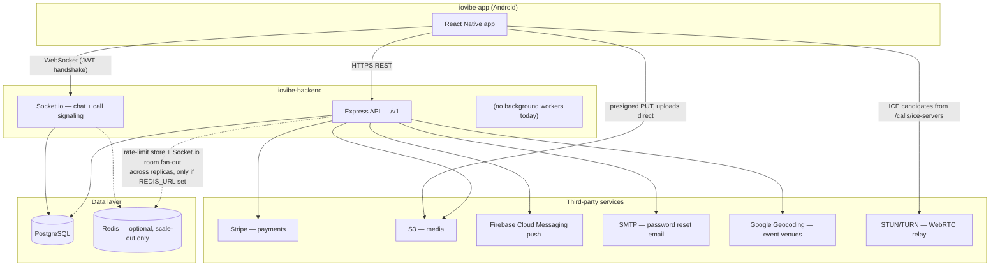

# System overview

## What this product is

A TikTok-style **social commerce** mobile app: a full-bleed vertical video feed
where every clip can be shoppable (watch → tap a product pill → buy), wrapped
in a social network — profiles, follow/friend graph, comments, DMs and group
chat, 1:1 video calls, and ticketed events. Android is the shipped platform;
iOS is code-complete on the backend side but the app's iOS build has not been
finished (see [07-handover-checklist.md](07-handover-checklist.md)).

There is no separate web app or admin dashboard. The only two things that
exist are the two repos this documentation covers.

## The two repos

```
IOVibe/
├── iovibe-app/        React Native (Android) — the product
└── iovibe-backend/    Node/Express/Postgres — this repo, the API
```

| | iovibe-app | iovibe-backend |
|---|---|---|
| What it is | The mobile client — the only UI that exists | The API + realtime server |
| Stack | React Native 0.86 (bare CLI), TypeScript | Node 20+, TypeScript, Express, Sequelize, PostgreSQL |
| Talks to | This backend, over HTTPS + one WebSocket | PostgreSQL, Stripe, S3, FCM, SMTP, Google Geocoding, STUN/TURN |
| Can run standalone? | **Yes** — ships with an in-process mock API (`USE_MOCK_API=true`) so every screen works with no server | No — it's the server |
| Default demo login | any email/password (mock mode) | seeded accounts: `{username}@demo.social` / `password123` |

**The contract runs one direction: the app is the spec.** Every backend
response is shaped to match a Zod schema the app already validates against
(originally against its own mock). Flipping the app from mock to real backend
is one env var (`USE_MOCK_API=false`) plus pointing `API_URL`/`WS_URL` at this
server — see [../ARCHITECTURE.md](../ARCHITECTURE.md) "The client is the
spec." If you change a response shape here, you are changing a contract the
client hard-validates; a drift throws in the app, not here.

## Architecture at a glance



Notes on that diagram:

- **The client uploads media directly to storage.** The API only issues a
  presigned S3 PUT URL (`POST /uploads/sign`) — video/image bytes never transit
  through this server. See [04-flows.md](04-flows.md) "Video publish."
- **There is no background job queue or worker process.** Every request is
  handled synchronously by the one Express process (or N stateless replicas
  behind a load balancer). This is deliberate at current scale — see "No
  background jobs" in [05-deployment-and-operations.md](05-deployment-and-operations.md).
- **Redis is optional**, not load-bearing at single-instance scale. It exists
  for two things if you ever run more than one API instance: a shared
  rate-limit counter (otherwise each replica enforces its own limit
  independently) and the Socket.io Redis adapter (otherwise a chat message
  only reaches sockets connected to the *same* instance as the sender).
- **Six third-party integrations, all env-gated.** Every one of them degrades
  to a clean 503 or no-op with no key set, rather than crashing or silently
  doing nothing wrong-looking. Full checklist: [../INTEGRATIONS.md](../INTEGRATIONS.md).

## Tech stack summary

| Layer | Choice |
|---|---|
| Runtime | Node 20+ (CI verifies 20 and 22) |
| Language | TypeScript, compiled to `dist/` for production |
| Web framework | Express 4 |
| ORM | Sequelize 6 against PostgreSQL 14+ (Docker locally, any managed or self-hosted server in production) |
| Realtime | Socket.io 4, optional Redis adapter for multi-instance fan-out |
| Auth | JWT access tokens (15 min) + rotating refresh tokens (30 day) stored server-side as sha256 hashes |
| Validation | Zod, at both the request boundary (validators) and mirrored in DB CHECK constraints where it matters |
| Payments | Stripe (PaymentIntents, two-step intent→confirm, webhook for reliability) |
| Media storage | S3 (or any S3-compatible service), client uploads direct via presigned PUT URL |
| Push | Firebase Cloud Messaging |
| Process manager | PM2 (`ecosystem.config.js`), single instance today |
| Testing | Jest + Supertest, 290 integration tests against a real Postgres, no mocked DB |

## What's genuinely not built yet

Two infrastructure pieces are deliberately deferred, not forgotten — both are
researched, costed, and written up so picking either up is a decision, not a
fresh investigation:

1. **No HLS transcode ladder.** Video plays as progressive MP4 direct from
   storage; no adaptive bitrate, no real poster frames, camera filters can't
   be baked into the recording.
2. **No SFU for group calls.** 1:1 calls carry real WebRTC audio/video; group
   calls ring everyone and show a roster but carry no media.

Full detail, options, and pricing: [../DEFERRED-DECISIONS.md](../DEFERRED-DECISIONS.md).

Smaller, real gaps — no admin UI (the moderation API has no console in front
of it), moderation is manual (no automated detection or rate-limiting) — are
tracked in [../README.md](../README.md#honest-gaps).
