# Database schema

PostgreSQL 14+ (Docker locally, any managed or self-hosted server in
production). Every table uses a `UUID` primary key
(`gen_random_uuid()` default). Schema is entirely **hand-authored migrations**
under `migrations/*.js` — Sequelize models never `sync()`; the migrations are
the source of truth, models describe them for query-building. To regenerate
this document after a schema change, diff `migrations/` since 2026-07-22 and
update the affected table(s) below.

Conventions used throughout, so they're not repeated per table:
- **`paranoid`** = soft-delete via a `deleted_at` column; a "deleted" row still
  exists and is excluded from default queries.
- Unless noted, foreign keys are `ON DELETE CASCADE ON UPDATE CASCADE`.
- **Money** is stored as an integer in minor units (cents) everywhere. The
  *wire* representation differs by domain and this is intentional, not
  inconsistent: commerce serializes to major-unit dollar floats
  (`price: 68`, `shipping: 6.99`), events serialize integer `priceCents`
  (`3500`). See [../ARCHITECTURE.md](../ARCHITECTURE.md) → "Data model
  conventions."
- **Denormalized counters** (`videos.like_count`, `events.attendee_count`, …)
  are maintained inside the same transaction as the row that changes them —
  never derived from a `COUNT(*)` at read time.

## Entity-relationship diagram

```mermaid
erDiagram
    USERS ||--o{ USER_SESSIONS : "has"
    USERS ||--o{ DEVICE_TOKENS : "registers"
    USERS ||--o{ PASSWORD_RESET_CODES : "requests"
    USERS ||--o{ VIDEOS : "authors"
    USERS ||--o{ ENGAGEMENTS : "makes"
    USERS ||--o{ COMMENTS : "writes"
    USERS ||--o{ COMMENT_LIKES : "makes"
    USERS ||--o{ FOLLOWS : "follows (as follower)"
    USERS ||--o{ FOLLOWS : "followed by (as followee)"
    USERS ||--o{ FRIEND_REQUESTS : "sends (as requester)"
    USERS ||--o{ FRIEND_REQUESTS : "receives (as addressee)"
    USERS ||--o{ BLOCKS : "blocks (as blocker)"
    USERS ||--o{ BLOCKS : "blocked (as blocked)"
    USERS ||--o{ ORDERS : "places"
    USERS ||--o{ CONVERSATION_MEMBERS : "joins"
    USERS ||--o{ MESSAGES : "sends"
    USERS ||--o{ EVENTS : "hosts"
    USERS ||--o{ EVENT_ATTENDEES : "attends"
    USERS ||--o{ CALL_RECORDS : "owns"
    USERS ||--o{ REPORTS : "files (as reporter)"
    USERS ||--o{ REPORTS : "reviews (as reviewer)"
    USERS ||--o{ NOTIFICATIONS : "receives (as recipient)"
    USERS ||--o{ NOTIFICATIONS : "triggers (as actor)"

    VIDEOS ||--o{ ENGAGEMENTS : "has"
    VIDEOS ||--o{ COMMENTS : "has"
    VIDEOS ||--o{ VIDEO_PRODUCTS : "tags"
    COMMENTS ||--o{ COMMENTS : "replies (parent_id, 1 level deep)"
    COMMENTS ||--o{ COMMENT_LIKES : "has"

    SELLERS ||--o{ PRODUCTS : "sells"
    PRODUCTS ||--o{ PRODUCT_IMAGES : "has"
    PRODUCTS ||--o{ PRODUCT_VARIANTS : "has"
    PRODUCTS ||--o{ VIDEO_PRODUCTS : "tagged in"
    PRODUCTS ||--o{ ORDER_ITEMS : "ordered as (nullable)"
    ORDERS ||--o{ ORDER_ITEMS : "contains"

    CONVERSATIONS ||--o{ CONVERSATION_MEMBERS : "has"
    CONVERSATIONS ||--o{ MESSAGES : "has"

    EVENTS ||--o{ EVENT_ATTENDEES : "has"

    USERS {
        uuid user_id PK
        string username
        string email
        boolean is_admin
    }
    VIDEOS {
        uuid video_id PK
        uuid author_id FK
        string filter_id "write-only, never served back"
    }
    ORDERS {
        uuid order_id PK
        uuid user_id FK
        enum status
        enum payment_status
    }
    CONVERSATIONS {
        uuid conversation_id PK
        boolean is_group
    }
    EVENTS {
        uuid event_id PK
        uuid host_id FK
        integer price_cents
    }
    CALL_RECORDS {
        uuid call_id PK
        uuid owner_id FK
        uuid peer_id "nullable, no FK - frozen snapshot"
        jsonb participants "group roster snapshot"
    }
    REPORTS {
        uuid report_id PK
        enum target_type "polymorphic, no FK"
        uuid target_id
    }
    NOTIFICATIONS {
        uuid notification_id PK
        enum type
        enum target_type "polymorphic, no FK"
    }
```

Two relationship shapes worth calling out because they're easy to miss reading
just the diagram:

- **Polymorphic targets, no FK**: `reports.(target_type, target_id)` and
  `notifications.(target_type, target_id)` point at either a user or a video
  (reports also allow comment) without a foreign key constraint — the target
  row can be deleted out from under a report, and the moderation detail view
  resolves it with `paranoid: false`, returning `null` rather than 500ing.
- **Frozen snapshots, no live FK**: `call_records` stores `peer_id` with no FK
  and a `participants` JSONB array for group calls — call history is a record
  of what happened, not a live join, so it must survive the peer's account
  being deleted or renamed.

## Tables by domain

### Identity & auth

**`users`**

| Column | Type | Notes |
|---|---|---|
| `user_id` | UUID PK | |
| `username` | VARCHAR(24) | `^[a-z0-9_.]+$`, 3–24 chars, lowercased on write |
| `email` | VARCHAR(255) | validated, lowercased on write |
| `password_hash` | VARCHAR(255), nullable | bcrypt, rounds via `BCRYPT_ROUNDS` (default 10) |
| `display_name` | VARCHAR(80) | |
| `avatar_url` | TEXT, nullable | |
| `bio` | TEXT | default `''` |
| `is_active` | BOOLEAN | default `true`; `false` → 403 on every subsequent request (see [06-security.md](06-security.md)) |
| `is_admin` | BOOLEAN | default `false`; gates `/admin/*` |
| `email_verified` | BOOLEAN | default `false` (not currently enforced anywhere) |
| `created_at`, `updated_at`, `deleted_at` | DATE | **paranoid** |

Indexes: partial unique on `username` and on `email`, both `WHERE deleted_at
IS NULL` — a soft-deleted account's handle and email become available again.
Plus two **pg_trgm GIN** indexes, `users_username_trgm` on `lower(username)` and
`users_display_name_trgm` on `lower(display_name)`: people-search does
`lower(col) LIKE '%q%'`, a leading-wildcard match no b-tree can serve, so these
let the substring search hit an index instead of sequentially scanning `users`
(the migration also `CREATE EXTENSION IF NOT EXISTS pg_trgm`).
`toJSON()` strips `password_hash` so it can never leak through an accidental
`res.json(user)`.

**`user_sessions`** — one row per active refresh-token session (device-level)

| Column | Type | Notes |
|---|---|---|
| `session_id` | UUID PK | |
| `user_id` | UUID FK → users | |
| `refresh_token_hash` | VARCHAR(64) UNIQUE | sha256 hex; the raw token is never stored |
| `user_agent`, `ip_address`, `device_type`, `device_label` | text/varchar, nullable | |
| `device_metadata` | JSONB | default `{}` |
| `last_used_at` | DATE | |
| `expires_at` | DATE | |
| `revoked_at`, `revoked_reason` | DATE / VARCHAR(50), nullable | |
| `rotation_count` | INTEGER | default 0 |

Indexes: unique on `refresh_token_hash`, plus `user_id`, `expires_at`, and a
composite `(user_id, revoked_at, expires_at)` for the active-session lookup on
every `protect`-ed request.

**`revoked_tokens`** — access-token blacklist

| Column | Type | Notes |
|---|---|---|
| `token_id` | UUID PK | |
| `token_hash` | VARCHAR(64) UNIQUE | sha256 of the raw JWT |
| `user_id` | UUID FK → users, **ON DELETE SET NULL**, nullable | |
| `expires_at` | DATE | mirrors the JWT's own `exp`, used for cleanup |
| `revoked_at` | DATE | default now |
| `reason` | VARCHAR(50), nullable | one of `logout, password_change, refresh_reuse, expired, admin_revoke, account_deleted` |

**`device_tokens`** — FCM push registration

| Column | Type | Notes |
|---|---|---|
| `id` | UUID PK | |
| `user_id` | UUID FK → users | |
| `token` | TEXT UNIQUE | |
| `platform` | ENUM(`ios`,`android`) | |

**`password_reset_codes`**

| Column | Type | Notes |
|---|---|---|
| `id` | UUID PK | |
| `user_id` | UUID FK → users | |
| `code_hash` | VARCHAR(64) | sha256 of the 6-digit code |
| `expires_at` | DATE | |
| `used_at` | DATE, nullable | single-use |
| `attempts` | INTEGER | default `0`; counts failed verifications against a live code. The service burns the code once this crosses the cap (5), so a targeted email can't be brute-forced within the expiry window |

### Social graph

**`follows`** — asymmetric, one row per direction

| Column | Type | Notes |
|---|---|---|
| `follow_id` | UUID PK | |
| `follower_id`, `followee_id` | UUID FK → users | |

CHECK `follows_no_self_follow (follower_id <> followee_id)`. Unique on
`(follower_id, followee_id)`; index on `followee_id` (follower-list lookups)
and `(follower_id, created_at)` (following-list pagination).

**`friend_requests`** — separate concept from follow; mutual, request-based

| Column | Type | Notes |
|---|---|---|
| `request_id` | UUID PK | |
| `requester_id`, `addressee_id` | UUID FK → users | |
| `status` | ENUM(`pending`,`accepted`) | default `pending` |

CHECK `friend_requests_no_self`. Unique on `(requester_id, addressee_id)`.
The viewer-facing `friendStatus` (`none / outgoing / incoming / friends`) is
computed per-request, not stored.

**`blocks`** — severs the graph both directions when checked

| Column | Type | Notes |
|---|---|---|
| `block_id` | UUID PK | |
| `blocker_id`, `blocked_id` | UUID FK → users | |

CHECK `blocks_no_self`. Unique on `(blocker_id, blocked_id)`.

### Feed & engagement

**`videos`**

| Column | Type | Notes |
|---|---|---|
| `video_id` | UUID PK | |
| `author_id` | UUID FK → users | |
| `hls_url` | TEXT | **misnomer** — currently a progressive-MP4 URL; named for the client's Zod field `hlsUrl`, which is pinned until a transcode pipeline exists |
| `thumbnail_url` | TEXT | today a placeholder (`picsum.photos`) — no frame-grab step exists |
| `caption` | TEXT | default `''` |
| `duration_ms` | INTEGER | min 1 |
| `sound_name` | VARCHAR(160), nullable | |
| `filter_id` | VARCHAR(32), nullable | **write-only** — persisted, never serialized back; see [../ARCHITECTURE.md](../ARCHITECTURE.md) "Write-only fields" |
| `like_count`, `dislike_count`, `comment_count`, `share_count`, `save_count` | INTEGER | denormalized, min 0 |
| `created_at`, `updated_at`, `deleted_at` | DATE | **paranoid** |

Indexes: `author_id`; `(created_at, video_id)` for feed keyset pagination.

**`engagements`** — like/dislike/save/bookmark/favorite, one row per (user, video, type)

| Column | Type | Notes |
|---|---|---|
| `engagement_id` | UUID PK | |
| `user_id` | UUID FK → users | |
| `video_id` | UUID FK → videos | |
| `type` | ENUM(`like`,`dislike`,`save`,`bookmark`,`favorite`) | |

Unique on `(user_id, video_id, type)`. Like/dislike are mutually exclusive —
enforced in the service layer, not the DB; save/bookmark/favorite are
independent.

**`comments`** — one level of replies via self-referential `parent_id`

| Column | Type | Notes |
|---|---|---|
| `comment_id` | UUID PK | |
| `video_id` | UUID FK → videos | |
| `author_id` | UUID FK → users | |
| `parent_id` | UUID FK → comments, nullable | one level deep, service-enforced |
| `body` | TEXT | |
| `like_count` | INTEGER | denormalized |
| `created_at` | DATE | **not paranoid — hard delete** |

Index: `(video_id, parent_id, created_at)` for the top-level/reply split;
`parent_id` alone for "N replies" counts.

**`comment_likes`**

| Column | Type | Notes |
|---|---|---|
| `like_id` | UUID PK | |
| `comment_id` | UUID FK → comments | |
| `user_id` | UUID FK → users | |

Unique on `(comment_id, user_id)`.

### Commerce

**`sellers`**

| Column | Type | Notes |
|---|---|---|
| `seller_id` | UUID PK | |
| `name` | VARCHAR(120) | |
| `rating` | REAL | default 5, 0–5 |

No `updated_at` (`timestamps: false`).

**`products`**

| Column | Type | Notes |
|---|---|---|
| `product_id` | UUID PK | |
| `seller_id` | UUID FK → sellers, **ON DELETE RESTRICT** | a seller can't be deleted while it has products |
| `title` | VARCHAR(200) | |
| `description` | TEXT | default `''` |
| `price_cents` | INTEGER | min 0; wire = major-unit float |
| `currency` | VARCHAR(3) | default `USD` |
| `stock` | INTEGER | default 0 — **enforced at checkout**: `orders/intent` atomically decrements it with a guarded `UPDATE … WHERE stock >= qty`; an over-quantity/out-of-stock line makes the whole checkout a 409 no-op, and two checkouts racing for the last unit can't both win |
| `created_at`, `updated_at`, `deleted_at` | DATE | **paranoid** |

**`product_images`** — `product_id` FK, `url`, `position` (no timestamps).
**`product_variants`** — `product_id` FK, `name`, `price_delta_cents` (default
0, added to the product price), `position` (no `updated_at`).

**`video_products`** — the shoppable-tag join table

| Column | Type | Notes |
|---|---|---|
| `id` | UUID PK | |
| `video_id` | UUID FK → videos | |
| `product_id` | UUID FK → products | |
| `position` | INTEGER | default 0 |

Unique on `(video_id, product_id)`. No timestamps.

**`orders`**

| Column | Type | Notes |
|---|---|---|
| `order_id` | UUID PK | |
| `user_id` | UUID FK → users | |
| `status` | ENUM(`confirmed`,`processing`,`failed`) | default `processing` — **the client-facing payment-derived status**, derived from `payment_status` |
| `payment_status` | ENUM(`requires_payment`,`processing`,`succeeded`,`failed`,`refunded`) | default `requires_payment` — internal, mirrors the Stripe PaymentIntent lifecycle |
| `shipping_address` | JSONB, nullable | `{recipientName, line1, line2, city, region, postalCode, country}`, collected at checkout |
| `fulfillment_status` | ENUM(`unfulfilled`,`shipped`,`delivered`) | default `unfulfilled` — the shipping lifecycle a seller drives, **separate from `status`** |
| `tracking_number`, `carrier` | VARCHAR, nullable | set when a seller ships |
| `shipped_at`, `delivered_at` | DATE, nullable | fulfillment timestamps |
| `currency` | VARCHAR(3) | default `USD` |
| `subtotal_cents`, `shipping_cents`, `tax_cents`, `total_cents` | INTEGER | server-computed, never trusted from the client |
| `payment_token` | VARCHAR(255), nullable | legacy, unused |
| `payment_intent_id` | VARCHAR(255) UNIQUE, nullable | Stripe PaymentIntent id |
| `cart_hash` | VARCHAR(64), nullable | SHA-256 of the canonical cart (sorted `productId:variantId:quantity`). Checkout reuses an existing still-unpaid order with the same `(user_id, cart_hash)` instead of minting a duplicate on a double-tap. Nullable — legacy rows predate the column |
| `refunded_at` | DATE, nullable | set when `POST /admin/orders/:id/refund` marks the order `refunded` |
| `created_at` | DATE | no `updated_at` (`timestamps: false`) |

Index `orders_user_cart_hash` on `(user_id, cart_hash)` serves the
checkout-idempotency reuse lookup.

Two status fields exist on purpose — see [04-flows.md](04-flows.md)
"Checkout" for how they diverge during a payment's lifecycle.

**`order_items`** — a frozen snapshot of what was bought, not a live join

| Column | Type | Notes |
|---|---|---|
| `order_item_id` | UUID PK | |
| `order_id` | UUID FK → orders | |
| `product_id` | UUID FK → products, **ON DELETE SET NULL**, nullable | |
| `variant_id` | UUID, nullable | **no FK constraint** |
| `title`, `variant_name`, `image_url` | text, nullable | **snapshot at purchase time** — a later product edit or deletion must not change a past receipt |
| `unit_price_cents` | INTEGER | |
| `quantity` | INTEGER | min 1 |
| `line_total_cents` | INTEGER | |
| `position` | INTEGER | default 0 |

### Messaging

**`conversations`**

| Column | Type | Notes |
|---|---|---|
| `conversation_id` | UUID PK | |
| `is_group` | BOOLEAN | default `false` |
| `title` | VARCHAR(120), nullable | group name; null for 1:1 |
| `created_by` | UUID, nullable | **no FK declared** |
| `last_message_body`, `last_sender_id`, `last_message_at` | text/uuid/date, nullable | denormalized inbox preview — avoids a join against `messages` for every row in the conversation list |

**`conversation_members`**

| Column | Type | Notes |
|---|---|---|
| `member_id` | UUID PK | |
| `conversation_id` | UUID FK → conversations | |
| `user_id` | UUID FK → users | |
| `role` | ENUM(`owner`,`admin`,`member`) | default `member` |
| `last_read_at` | DATE, nullable | drives per-member unread count |
| `joined_at` | DATE | |

Unique on `(conversation_id, user_id)`.

**`messages`**

| Column | Type | Notes |
|---|---|---|
| `message_id` | UUID PK | |
| `conversation_id` | UUID FK → conversations | |
| `sender_id` | UUID FK → users | |
| `body` | TEXT | default `''` |
| `image_url` | TEXT, nullable | |
| `attachment` | JSONB, nullable | `{type: 'product'|'video'|'image', productId?, videoId?, url?}` — modeled, currently always null (no producer wired) |
| `status` | ENUM(`sent`,`delivered`,`read`) | default `sent` |
| `created_at`, `read_at` | DATE | |

Index: `(conversation_id, created_at)`.

### Events

**`events`**

| Column | Type | Notes |
|---|---|---|
| `event_id` | UUID PK | |
| `host_id` | UUID FK → users | |
| `title`, `description` | text | |
| `cover_url` | TEXT | |
| `starts_at` | DATE | |
| `ends_at` | DATE, nullable | |
| `location_name` | VARCHAR(200) | |
| `price_cents` | INTEGER | default 0 — **integer minor units on the wire too**, unlike commerce |
| `currency` | VARCHAR(3) | default `USD` |
| `latitude`, `longitude` | DOUBLE, nullable | null until server-side geocoding runs |
| `attendee_count` | INTEGER | denormalized, default 0 |

Index: `starts_at` (upcoming-first listing), `host_id`.

**`event_attendees`**

| Column | Type | Notes |
|---|---|---|
| `id` | UUID PK | |
| `event_id` | UUID FK → events | |
| `user_id` | UUID FK → users | |
| `has_ticket` | BOOLEAN | default `false` — distinguishes a free RSVP from a paid ticket |
| `payment_intent_id` | VARCHAR(255), nullable | |

Unique on `(event_id, user_id)`.

### Calls

**`call_records`**

| Column | Type | Notes |
|---|---|---|
| `call_id` | UUID PK | |
| `owner_id` | UUID FK → users | whose call-log row this is |
| `peer_id`, `peer_username`, `peer_avatar_url` | uuid/text, nullable | **no FK — frozen snapshot**, set only for a 1:1 call |
| `is_group` | BOOLEAN | default `false` |
| `participants` | JSONB | default `[]`; array of `{id, username, avatarUrl}` snapshots, populated only for a group call |
| `direction` | ENUM(`incoming`,`outgoing`) | |
| `is_video` | BOOLEAN | default `false` |
| `outcome` | ENUM(`completed`,`missed`,`declined`) | |
| `started_at` | DATE | |
| `duration_sec` | INTEGER | default 0 |

CHECK `call_records_peer_xor_group` enforces exactly one of `peer_*` /
`participants` is populated — mirrored by the request validator, so a row the
serializer can't describe can never exist. Index: `(owner_id, started_at)`.

### Moderation & notifications

**`reports`**

| Column | Type | Notes |
|---|---|---|
| `report_id` | UUID PK | |
| `reporter_id` | UUID FK → users | |
| `target_type` | ENUM(`video`,`user`,`comment`) | **polymorphic, no FK** |
| `target_id` | UUID | |
| `reason` | VARCHAR(120) | free text — the client sends one of 7 canned reasons, not DB-enforced |
| `status` | ENUM(`pending`,`actioned`,`dismissed`) | default `pending` |
| `reviewed_by` | UUID FK → users, **ON DELETE SET NULL**, nullable | |
| `reviewed_at`, `resolution_note` | date/text, nullable | |

Indexes: `(target_type, target_id)` (resolving all reports against one
target); `reporter_id`; a partial index on pending reports for the queue.

**`notifications`**

| Column | Type | Notes |
|---|---|---|
| `notification_id` | UUID PK | |
| `recipient_id` | UUID FK → users | |
| `actor_id` | UUID FK → users, **ON DELETE SET NULL**, nullable | |
| `type` | ENUM(`follow`,`friend_request`,`friend_accept`,`comment`,`comment_reply`) | |
| `target_type` | ENUM(`user`,`video`) | polymorphic, no FK |
| `target_id` | UUID | |
| `read_at` | DATE, nullable | `null` = unread |

CHECK `notifications_no_self`. Indexes: keyset `(recipient_id, created_at,
notification_id)` for the list; a **partial** index `(recipient_id) WHERE
read_at IS NULL` for the unread-count badge, polled far more often than the
list is read.

## Migration history

Chronological, in `migrations/`:

| File | Adds |
|---|---|
| `20260717000000-baseline-auth-feed.js` | users, sessions, revoked tokens, videos, engagements |
| `20260718000000-social-comments-reports.js` | follows, friend requests, blocks, comments, comment likes, reports |
| `20260718010000-commerce.js` | sellers, products, images, variants, video_products, orders, order_items |
| `20260718020000-messaging.js` | conversations, conversation_members, messages |
| `20260718030000-events-calls.js` | events, event_attendees, call_records (1:1 only at this point) |
| `20260719000000-payments.js` | Stripe fields on orders/event_attendees |
| `20260719010000-device-tokens.js` | device_tokens |
| `20260719020000-password-reset-codes.js` | password_reset_codes |
| `20260719030000-add-video-filter-id.js` | `videos.filter_id` |
| `20260719040000-group-call-records.js` | widens call_records for group calls (`is_group`, `participants`, the xor CHECK) |
| `20260720000000-notifications.js` | notifications |
| `20260721000000-user-is-admin.js` | `users.is_admin` |
| `20260721010000-report-workflow.js` | report resolution fields + partial index |
| `20260722000000-password-reset-attempts.js` | `password_reset_codes.attempts` (reset-code brute-force cap) |
| `20260722010000-orders-cart-hash.js` | `orders.cart_hash` + `(user_id, cart_hash)` index (checkout idempotency) |
| `20260722020000-user-search-trgm.js` | pg_trgm extension + GIN indexes on `lower(username)` / `lower(display_name)` (user search) |

Run `npm run make-migration <name>` to scaffold a new one — never hand-edit a
migration that has already run against any shared environment; add a new one.
