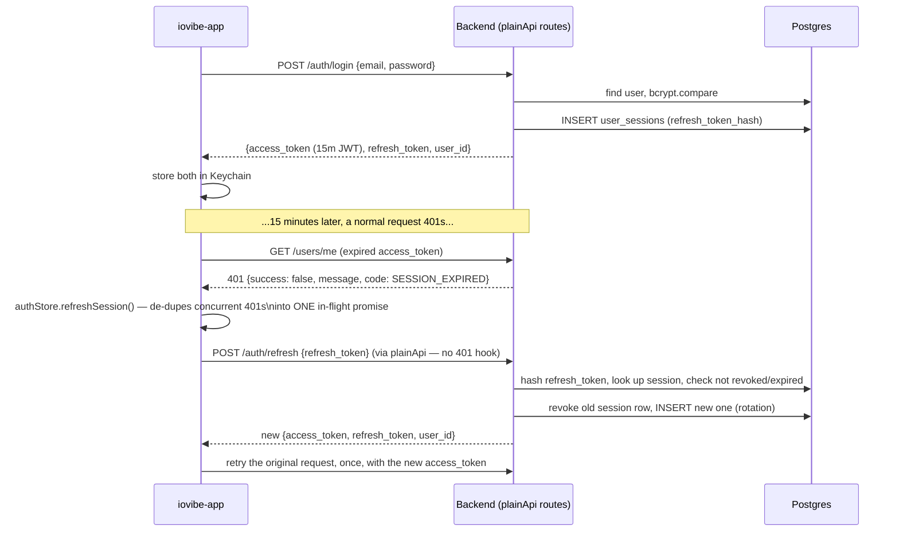
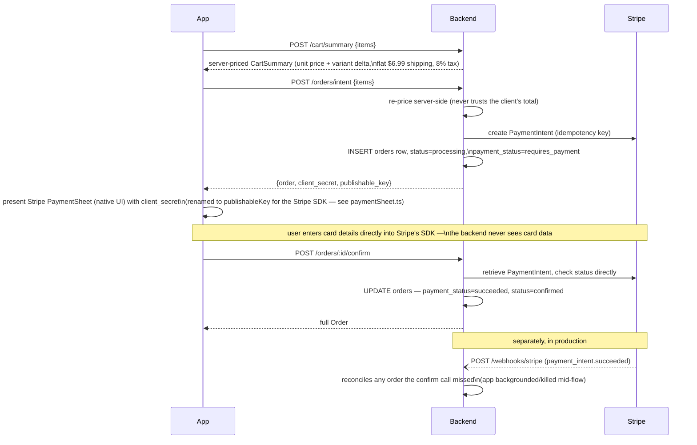
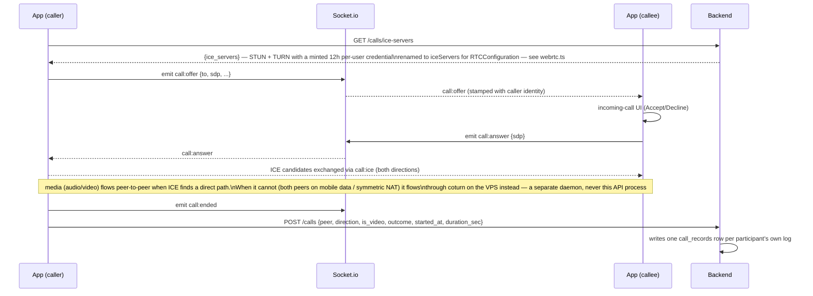
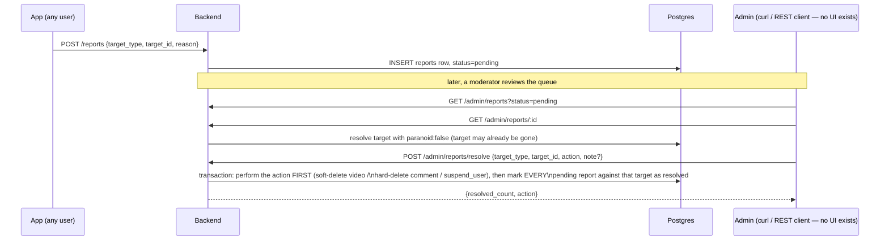

# Flows

Sequence diagrams for the requests that span multiple parts of the system —
where reading the endpoint list alone doesn't tell you the order things
happen in, or why they're split into multiple calls. Each is followed by the
non-obvious decisions baked into it.

## Login and token refresh



**Why refresh tokens rotate.** Every refresh both invalidates the old token
and issues a new one (`rotation_count` increments). If a refresh token is
ever replayed after rotation — a sign of theft — the session is revoked with
`reason: refresh_reuse` rather than silently accepted twice.

**Why refresh and retry share one promise on the client, not the server.**
The server's job is just "verify this refresh token, once." The interesting
problem — five requests 401 at once, don't fire five refresh calls — is
solved app-side (`authStore.refreshSession()`), not here. This doc calls it
out because it's easy to assume the dedup is server-side and go looking for
it in the wrong repo.

**Why `plainApi` (no `Authorization` header, no 401 hook) is mandatory for
every auth endpoint.** A refresh call that itself 401s must not trigger
*another* refresh — that's an infinite loop, not a retry. `POST
/auth/logout` is the one exception that still needs a header: it's
`protect`-ed (it must blacklist the specific access token it's revoking), so
the app sets the header explicitly on that one `plainApi` call rather than
routing it through the normal client. See [../ARCHITECTURE.md](../ARCHITECTURE.md)
(app repo) → "Auth: `api` vs `plainApi`."

## Checkout (commerce)



**Why two calls instead of one `POST /orders`.** Money is never computed or
trusted client-side. `/orders/intent` prices the cart and creates the
PaymentIntent server-side; the app's only job between intent and confirm is
to show Stripe's own UI and let Stripe collect the card. `/orders/:id/confirm`
then re-verifies the PaymentIntent directly with Stripe before marking
anything paid — which is also why **checkout works correctly in local dev
with no webhook configured.**

**What the webhook is actually for.** Not correctness — reliability. If the
app is killed or backgrounded between the PaymentSheet closing and the
confirm call landing, Stripe still processed the payment; the webhook is what
reconciles that order without the client's cooperation. It's mounted before
`express.json()` in `app.ts` because Stripe's signature verification needs
the raw, unparsed request body.

**The `$0` / no-key path.** With no `STRIPE_SECRET_KEY` set, a priced order
returns a clean 503 at the intent step and creates nothing. A `$0` order (and
a free event ticket, same shape) completes end-to-end through a `provider:
'none'` branch that skips Stripe entirely — this is how the integration-gated
test suite exercises the full order lifecycle without live Stripe.

Event ticketing (`/events/:id/tickets/intent` → `/tickets/confirm`) is the
identical shape — same reasoning applies.

## Video publish (upload + feed)

```mermaid
sequenceDiagram
    participant App
    participant API as Backend
    participant Storage as S3 bucket
    participant DB as Postgres

    App->>API: POST /uploads/sign {kind: "video", content_type, content_length}
    API-->>App: signed PUT URL (short-lived, bound to that exact type + size)
    App->>Storage: PUT video bytes directly
    Note over App,Storage: the API never sees or proxies the video file;<br/>a PUT of any other size or type is 403'd by S3
    App->>API: POST /videos {video_url, thumbnail_url?, caption,\nduration_ms, filter_id?, product_ids?}
    API->>DB: INSERT videos row (filter_id stored, not yet consumed)
    API-->>App: 201 Video
    App->>App: invalidate feed cache — new clip appears
```

**Why the API only issues a signed URL.** Proxying video bytes through the
Express process would make it the bottleneck for every upload. The client
uploads direct to storage; the API's only job is authorizing *that* upload
and recording the result afterward.

**What doesn't happen today.** There is no transcode step. `hls_url` (the DB
column and the wire field) holds the raw uploaded file's URL — a progressive
MP4, not an HLS playlist. The camera filter the clip was shot with
(`filter_id`) is stored specifically so a *future* transcode worker can bake
it in; nothing consumes that column yet. `thumbnail_url` is a random
`picsum.photos` placeholder because there's no frame-grab step. All three are
one deferred decision, not three — see
[../DEFERRED-DECISIONS.md](../DEFERRED-DECISIONS.md) §1.

## Chat message delivery

```mermaid
sequenceDiagram
    participant Sender as App (sender)
    participant API as Backend
    participant DB as Postgres
    participant WS as Socket.io
    participant Recipient as App (recipient)

    Sender->>API: POST /conversations/:id/messages {body, image_url?}
    API->>DB: INSERT messages row; UPDATE conversations\n(last_message_body/sender/at)
    API-->>Sender: 201 Message
    API->>WS: emit message:new to room user:<each member>
    WS-->>Recipient: message:new (if connected)
    Note over Recipient,API: if not connected, the recipient still sees it via\nGET /conversations/:id/messages (HTTP polling) — the\nsocket is an enhancement, not the only delivery path
    API->>API: writes a notifications row for follow/friend/comment events —\n**not** for chat messages (the inbox already owns\nper-conversation unread state; see notifications below)
```

## Notifications

Notifications are the durable counterpart to an FCM push, written from the
same service call that fires the push — never a separate pipeline that could
disagree with it.

```mermaid
sequenceDiagram
    participant Actor as App (actor, e.g. follows someone)
    participant API as Backend
    participant DB as Postgres
    participant FCM as Firebase Cloud Messaging
    participant Recipient as App (recipient)

    Actor->>API: POST /users/:id/follow
    API->>DB: INSERT follows row
    API->>DB: INSERT notifications row (type=follow, target=user)
    API->>FCM: send push (if recipient has a registered device token)
    FCM--)Recipient: push notification (may be missed if device is off)
    Recipient->>API: GET /notifications  (any time later)
    API-->>Recipient: the row is still there — a missed push isn't a lost notification
```

Deliberately **not** modeled this way: chat messages. A message send does not
write a `notifications` row — the inbox already tracks per-conversation
unread state via `conversation_members.last_read_at`, and duplicating that
here would split "unread" across two sources of truth.

## Call signaling (1:1 WebRTC)



**Group calls use the identical signaling relay** but the app currently only
rings every participant and shows a roster — there's no SFU forwarding media
between more than two peers. See
[../DEFERRED-DECISIONS.md](../DEFERRED-DECISIONS.md) §2.

## Moderation



**The unit of moderation is the target, not the individual report.** A viral
bad video collects dozens of reports; resolving them one at a time isn't
usable, so one resolve call closes every pending report against that target
in a single transaction. The content action runs first — if it fails,
nothing gets marked resolved, so a failed moderation action can't silently
disappear from the queue.
