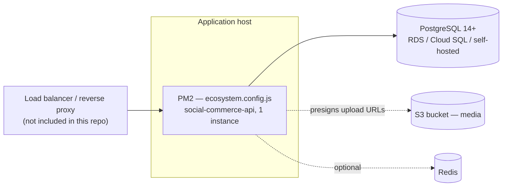

# Deployment and operations

## Current production shape

One stateless Express process, managed by PM2, talking to a single PostgreSQL
server. No background workers, no job queue, no CDN in front of the API (media is
served direct from the S3 bucket, or from a CDN in front of it if
`S3_PUBLIC_BASE_URL` is set).



There is no reverse proxy or TLS termination configured *in this repo* —
that's assumed to be handled by whatever host it's deployed to (a managed
platform's ingress, or an nginx/Caddy layer you own). `trust proxy: 1` is set
in `app.ts`, so it's expecting exactly one proxy hop in front of it for
`req.ip` to be correct.

## Deploying a change

1. `npm run build` — compiles `src/` to `dist/` and copies `config.cjs`
   alongside it (sequelize-cli's runtime config).
2. `npm run migrate:prod` — applies migrations using `.env.production` (see
   below for why migrations may use a different connection than the app).
   `npm run migrate` is the same thing against `.env.development`.
3. `pm2 start ecosystem.config.js` (first deploy) or `pm2 reload
   social-commerce-api` (subsequent — reload is a graceful restart, not a
   kill).
4. Confirm `GET /health` returns 200 before considering the deploy live.

There is no CI/CD pipeline that deploys automatically — `.github/workflows/ci.yml`
runs migrate → typecheck → lint → test on every push/PR (Node 20 and 22,
against a `postgres:16` service container) but does **not** push to any
environment. Wiring an actual deploy step (to whatever host is chosen) is
part of what a new team needs to set up — see
[07-handover-checklist.md](07-handover-checklist.md).

## Environment files

Three templates are committed, one per environment; none contain real
secrets:

| File | Used by |
|---|---|
| `.env.development` | `npm run dev` — targets the Docker Postgres (`npm run db:up`, host port 5433) |
| `.env.production` | referenced by `ecosystem.config.js`'s `env_file` |
| `.env.test` | the Jest suite (CI overrides the `DB_*` vars directly, see below) |

Every key is documented with what it's for and how to get it in
[../INTEGRATIONS.md](../INTEGRATIONS.md) — that file is the provisioning
checklist; this doc is about what happens once the values exist.

**Leave an unobtained key empty, never placeholder-filled.** Every
integration checks for the *presence* of its key and returns a clean 503 /
no-op when absent. A leftover `sk_test_...` or a placeholder bucket name
constructs a real client that then fails deep inside a request with a
confusing provider error — worse than the deliberate 503.

**Two production values are enforced at boot (the process won't start otherwise):**

- **`JWT_SECRET`** must be a real secret ≥32 chars (not a placeholder like
  `__CHANGE_ME__`). Generate with `openssl rand -base64 48`.
- **Database TLS** must be verified: set `DB_SSL_CA_PATH` to the provider CA
  bundle. If you knowingly accept an unverified link, set
  `DB_SSL_ALLOW_UNVERIFIED=true` — the app then boots but logs a MITM warning.

Optional pricing knobs (default to the app-mock values, so leaving them unset is
fine): `TAX_RATE` (`0.08`) and `SHIPPING_FLAT_CENTS` (`699`).

## Database connections: pooler vs. direct

**Only relevant if a connection pooler (PgBouncer, RDS Proxy, a provider's
built-in pooler) sits between the app and Postgres.** Connecting straight to the
server needs just `DATABASE_URL`, and this section doesn't apply. When a pooler is
in play, two connection strings reach the same database for two different things,
and mixing them up breaks in ways that are annoying to diagnose:

- **`DATABASE_URL`** — what the running app uses. Must be a **session-mode**
  endpoint: it speaks the full Postgres wire protocol Sequelize needs (advisory
  locks, prepared statements inside transactions, LISTEN/NOTIFY).
- **`DATABASE_DIRECT_URL`** — what migrations use, via `config/config.cjs`.
  This bypasses the pooler entirely, because **transaction** pooling breaks
  session-dependent DDL. Unset → migrations fall back to `DATABASE_URL`.

`config/db.ts` prefers `DATABASE_URL` when set, falling back to discrete
`DB_HOST`/`DB_PORT`/etc. for local dev against the Docker Postgres (no pooler
involved locally).

## Bringing up a fresh environment

```bash
# 1. Provision Postgres 14+ and an S3 bucket, then fill in .env.production:
#    DATABASE_URL, JWT_SECRET, DB_SSL_CA_PATH, S3_BUCKET, S3_REGION
#    (+ DATABASE_DIRECT_URL only if a pooler fronts the database)
#    Bucket policy / CORS / IAM: ../INTEGRATIONS.md §4

# 2. First bring-up only — this is destructive, see the warning below
bash scripts/db-reset-remote.sh

# 3. Subsequent schema changes
npm run migrate:prod

# 4. Optional — demo data (skip on a real deployment with real users)
npm run seed:prod
```

**`scripts/db-reset-remote.sh` is destructive by design** — it runs `DROP
SCHEMA public CASCADE; CREATE SCHEMA public;` before re-migrating. It is
correct exactly once, on a brand-new empty database. Never run it
against an environment that holds real user data; use `npm run
migrate:prod` for every change after the first.

## Local dev reset

`npm run db:reset` — wipes the **local** dev schema only (guarded: it
inspects `DB_NAME` and refuses to run against anything that doesn't look like
a dev/test database), then run `migrate` and `seed` after. `npm run seed` on
its own is a full reset too (`TRUNCATE ... CASCADE` + re-insert 16 demo
users, feed, products, chats, events, calls) — safe to run any time in dev,
but note it also clears every session, logging everyone out.

## Process management (PM2)

`ecosystem.config.js`:

- `instances: 1` — **raise this only once `REDIS_URL` is set.** Without
  Redis, Socket.io rooms are in-memory per-instance: a chat message from a
  user connected to instance A never reaches a recipient connected to
  instance B. Scaling the process count without also turning on the Redis
  adapter silently breaks realtime delivery for some fraction of users
  (HTTP polling still works — see [04-flows.md](04-flows.md) "Chat message
  delivery" — so it's a *degradation*, not an outage, but a confusing one to
  debug without knowing this).
- `max_memory_restart: '512M'` — PM2 restarts the process if it exceeds this.
- `kill_timeout: 25000` — must stay **above** the app's own graceful-shutdown
  window (~20s, giving in-flight requests time to finish) or PM2 SIGKILLs a
  request mid-response instead of letting it drain.

## Health checks

| Endpoint | Checks | Use for |
|---|---|---|
| `GET /live` | nothing — returns 200 unconditionally | liveness probe / "is the process up" |
| `GET /health` | DB connectivity + Redis (if configured) | readiness probe — should gate traffic, not just restarts |

Neither is authenticated or rate-limited.

## Scaling notes

- The app is stateless — horizontal scaling is safe **once Redis is turned
  on** (rate-limit store + Socket.io adapter both need it to behave correctly
  across instances; see above).
- The database is the actual scaling constraint at any real volume — check
  `DB_POOL_MAX` (default 10 per instance) against the server's
  `max_connections` (or the pooler's pool size) before adding replicas.
- There is no caching layer beyond the denormalized counters already in the
  schema (like/comment/attendee counts computed once at write time, not read
  time). If a hot endpoint needs caching later, Redis is already in the
  dependency graph.
- No CDN is configured for media by default — the bucket serves files directly.
  Putting CloudFront (with Origin Access Control) in front and setting
  `S3_PUBLIC_BASE_URL` to its domain is a one-env-var change that also lets the
  bucket go fully private. This is the same underlying gap as the missing HLS
  ladder (see [../DEFERRED-DECISIONS.md](../DEFERRED-DECISIONS.md)), but a much
  smaller, separate improvement if that's picked up first.

## No background jobs — why that's fine today, and when it stops being fine

Every request is handled synchronously within its own HTTP call — there is no
queue, no cron, no worker process. This is a direct consequence of what
*isn't* built yet: the two deferred pieces
([../DEFERRED-DECISIONS.md](../DEFERRED-DECISIONS.md)) — an HLS transcode
step and an SFU — are exactly the kind of work that would need a queue
(transcode jobs) or a long-lived process (SFU room state). If either is
picked up, that's the point at which this section needs rewriting alongside
it.

## Logging

`pino` (+ `pino-pretty` in dev) via a custom `requestLogger` middleware.
`LOG_LEVEL` env var (default `debug`). No log aggregation/shipping is
configured in this repo — wiring logs to whatever the new team's observability
stack is (Datadog, CloudWatch, a hosted Loki, etc.) is environment setup, not
application code.

There is no error-tracking SDK on the backend (no Sentry-equivalent here —
the mobile app has one, gated on `SENTRY_DSN`, but the backend does not).
Uncaught errors go through `middlewares/error.ts` and are logged, not
reported anywhere external. Consider this a gap to close if this becomes a
priority.

## Rotating secrets

- **`JWT_SECRET`** — rotate only deliberately. Rotating it invalidates every
  currently-issued access token instantly (every logged-in user gets a 401 on
  their next request and has to re-authenticate via refresh, which itself
  re-signs with the new secret — so a user with a *valid, unexpired* refresh
  token recovers automatically; one whose session already expired does not).
- **`STRIPE_SECRET_KEY`** / **`STRIPE_WEBHOOK_SECRET`** — rotating the secret
  key doesn't affect in-flight PaymentIntents (Stripe-side state), but the
  webhook secret must be updated in lockstep with whatever's configured in
  the Stripe Dashboard for that webhook endpoint, or signature verification
  starts failing for every event.
- **`AWS_ACCESS_KEY_ID` / `AWS_SECRET_ACCESS_KEY`** — server-only. Rotate by
  creating a second access key on the same IAM identity, deploying it, then
  deleting the old one (zero-downtime; a single identity may hold two keys).
  Prefer removing them altogether in favour of an instance/task role. Scope the
  policy to `s3:PutObject` on the media bucket — the server never reads or
  deletes objects, so a leak of these keys should not expose stored data.
- **`FCM_SERVICE_ACCOUNT_BASE64`** — rotate via Firebase → Service accounts →
  generate a new key, revoke the old one from the same screen.

None of these need a code change to rotate — only an env var update and a
restart/reload.
